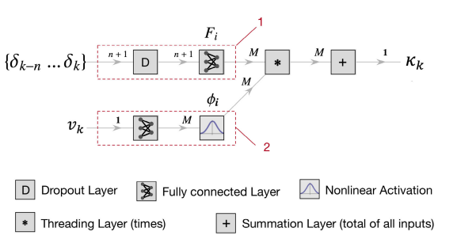
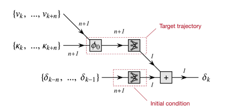

# Documentation

A Fuzzy layer in nnodely (the Fuzzify block) is a membership-function encoder that converts a crisp numeric variable (e.g. gear number, speed range, temperature, etc.) into a set of fuzzy activations, each representing how much the input belongs to a predefined region.

In other words:

A Fuzzy layer transforms a scalar input into multiple “membership signals” that softly activate different sub-models depending on the operating region.

This is the core idea behind local models in nnodely: instead of using a single global neural model, you define several simpler models — each valid in a specific operating region — and the fuzzy layer blends them.

Dreams4Cars --> diviso in due parti: sleep mode and wake mode. In wake mode prende i dati per il training del predictive model, mentre poi nella sleep mode sintetizza il controllo e il comportamento. 

Che è come dovrebbe lavorare nnodely: prima in un  modello costruisce la dinamica e poi usando il modello costruito ci costruisce sopra il controllo.

Reinforcement learning è un approccio che combina le soluzioni di controllo ottimo provando delle azioni e osservando i risultati.

- **Forward model:**
  - **Modeling**: Selezionare modelli neurali fisici
  - **Training**: Allenare la rete con i dati
  - **Evaluation**: Valutare tramite le varie metriche i residui della rete neurale
- **Inverse model:**
  - **Modelling**: Selezionare il modello di rete neurale
  - **Training**: Allenare la rete con simulazioni/dati
  - **Evaluation**: Valutare la rete e la predizione della traiettoria, usando dati reali/sul veicolo

Forward model --> dinamica diretta, dato acceleratore/freno/sterzo costruire la traiettoria e il profilo di velocità

Inverse model --> dinamica inversa, opposta a quella descritta sopra

Learning ***Forward Model*** può essere diviso in tre parti:
 - Modeling
 - Training
 - Evaluate

Per le recurrent networks esistono gli stati interni, quindi si può descrivere una dinamica per questi.

## Unica forza: 
Si utilizza un'unica equazione che descrive tutte le forze che modificano il modello dinamico del sistema.

## Superposition of the effects:
Ricordarsi che le forze si possono sommare.
Per esempio possiamo descrivere l'accelerazione di un veicolo in questo modo:

$$
  m a = T_e - F_D - F_v - F_r - F_y sin(\delta)
$$

dove:
- $T_e$ è la torque esterna,
- $F_D$ è la forza di Drag,
- $F_v$ è la forza dovuta agli attriti viscosi,
- $F_r$ è la forza dovuta agli attriti di rotolamento,
- $F_ysin(\delta)$ è la forza dovuta al combinato.

Queste varie forze possono essere strutturate con reti divise fra di loro e poi sommate.

## Superposition + weights:
$$
  m a = \phi_0T_t - \phi_1T_b - \phi_2F_D - \phi_3F_v - \phi_4F_r - \phi_5F_y sin(\delta)
$$

$\phi_i$ è la funzione di attivazione, molto utile nel caso in cui ci siano componenti che dovrebbero essere a zero in certi casi, come mostrato nell'equazione d'esempio. 

Dove $\phi_0$ serve per attivare la torque dei motori, mentre $\phi_1$ serve per attivare la torque frenante. 

*Rircorda:* BSPD, il pilota tende a frenare e accelerare contemporaneamente:
Le funzioni di attivazione possono essere soggette a learning o possono essere predefinite dall'utente.

## Understeering gradient

L'understeering gradient ($k_{us}$) serve per indicare il comportamento di un veicolo.
Può essere descritto in due modi:
- a sterzo costante
- a curvatura costante

Se prendiamo il grafico *curvatura-accelerazione laterale* l'understeering gradient è la derivata della curva che si genera.
Di solito si considera in questo modo: 
$
\frac{1}{1+ Av^2}
$,
quindi dipendente dalla velocità al quadrato.

## Base model of a force + activation function

L'immagine indica chiaramente come viene definito il lavoro. Nel primo branch c'è lo sterzo che comporta una certa forza che può entrare in gioco, in base al secondo branch che è dipendente dalla velocità.

D --> Dropout layer (prevenire l'overfitting), disattivando casualmente dei perceptron

## Synthesis of inverse models

L'inverse model viene messo in serie al forward model. 
In ingresso all'inverse model passa la curvatura $k_i(t)$ e poi escono i controlli, in questo caso sterzo.

Poi il forward model restituisce una curvatura, $\overline{k_i}(t)$, dati in ingresso i controlli.

Vengono cambiati i pesi dei layers per minimizzare la differenza tra le due curvature. 

### Crossover e Mutation Operator

Crossover: serve per selezionare due diverse curvature in base all'istante di tempo.
In questo modo si possono creare diversi numeri di episodi.

Mutation: serve per cambiare gli episodi, in modo da ottenerne alcuni più "esotici", quindi particolari. 

## Inverse Network Architecture

L'obiettivo è quello di imparare a risolvere un MPC, model predictive control, passandogli gli output desiderati e quindi trainando gli input (i controlli).

Il modello viene diviso in due parti:
- Initial condition, per passare il valore iniziale dei controlli, per sapere lo step dopo;
- Target trajectory, traiettoria che si vuole realizzare.

## Evaluation

Qui verrano ricordati i criteri usati per capire quanto è stato studiato bene il modello inverso

### 1) Quality of inversion

Quanto bene il modello inverso cancella il modello dinamico, si usa la RMSE e si ha un errore maggiore sugli episodi usati per la validazion.

### 2) Inverse model accuracy

L'accuracy del modello inverso

### 3) Computational time

Tempo di computazione, il modello inverso è circa 5 volte più veloce di un MPC entrambi su un Intel i7 2.9 GHz.

## Traditional Approach

### Single Track model

Spesso usato per i modelli per il controllo laterale, poche variabili, ma poco preciso. Addirittura non tiene contro del trasferimento di carico longitudinale se il controllo è solo laterale. 
Comunque bisogna tenere conto di alcune funzioni data-driven, tipo Pacejka.

Tuttavia il modello così non riesce a cattuare certe risposte ad impulsi, mentre le reti ne sono in grado. Ad alta frequenza il single track è troppo semplificato, creando dinamiche completamente implausibili.

## Network augmentation

Per migliorare le prestazione del modello neurale si possono aggiungere diversi modelli locali. 

## Learning non linearities

Le asimmetrie del veicolo fanno in modo di modificarne il comportamento ad alte velocità, rendendolo più instabile. Ma sono facilmente imparabili in caso di reti neurali.
Ci sono diversi metodi per impararli:

### Method A

Imparare biases e non linearità quadratiche/cubiche.

#### Biases 

basta considerare un valore costante $b_i$.
In questo modo vengono imparati diversi bias per ogni local model.

#### Quadratic & cubic

Per imparare la componente quadratica questa è l'equazione usata nell'esempio:

$f(\delta) = \delta + a\delta^2$.

Il problema è che non cattura le asimmetrie, in quanto la funzione quadratica è simmetrica.

Allora bisogna usare una funzione cubica:

$f(\delta) = \delta + a\delta^3$.

In entrambi i casi '$a$' è il parametro da imparare.

### Method B

Si utilizza una funzione per tenere traccia di come cambia la variabile non lineare, in questo caso lo sterzo.

$x_{i, t} = tanh(A_ix_{i, t} + B_i\delta_t  + b_i)$

Questi valori stanno tra [-1, 1].

La parte di learning è divisa in due, prima si allena con '$B_i$' = 0, poi si freeza il risultato ottenuto e si traina con '$B_i$'.

## Learning secondary inputs

La parte che lavora a frequenza tra 0.02 - 0.1 Hz è stata attenuata un po' dalle correzioni fatte precendentemente.

Per sistemare questo problema bisogna accopiare la dinamica longitudinale e laterale, questo perché la forza massima cambia in base alla condizione:
se si ha una certa $F_{x_{max}}$ in longitudinale quando entra in gioco lo slip laterale allora la forza massima cala.

### Acceleration effect (linear model)

Consideriamo che l'accelerazione longitudinale faccia cambiare la curvatura. Quindi possiamo provare a fittare questo modello:

$\Delta k = \alpha_l a_k$

dove $\alpha_l$ è il parametro da fittare.

### Acceleration effect (piecewise linear model)

Creare una funzione a tratti per dividere il pedale dell'acceleratore e del freno: 

$$
\Delta k_k =
\begin{cases}
\alpha_1 a_k + \alpha_2 a_k \delta_k, & \text{se } a_k \ge 0,\\
\beta_1 a_k + \beta_2 a_k \delta_k, & \text{se } a_k < 0.
\end{cases}
$$

È corretto anche considerare che la curvatura può variare se consideriamo lo sterzo.
I parametri da imparare sono: $\alpha_1, \alpha_2, \beta_1, \beta_2$.

## Stability analysis of the inverse model

Per verificare la stabilità: consideriamo la funzione di trasferimento nel dominio 'z', per dimostrare che sia stabile si guarda dove finiscono i poli: tutti interno al cerchio unitario vuol dire che è stabile.